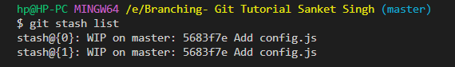

A basic understanding of git stash:

Can be said as a private locker where the changes can be stored temporarily, anything that is stashed is not a part of the commit.

Coming to more technical details:

Whenever we have some code changes that we don't want them to be a part of the next commit, we can add those changes to the staging area and then use `git stash`.

For our tutorial purpose, we want to stash config.js 

To view all the stash, we can use `git stash list`.

On using `git stash list`, we can see the different stashes, something like : 

The `git stash show` command is used in Git to display the changes that are stored in a stash. 