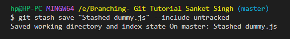
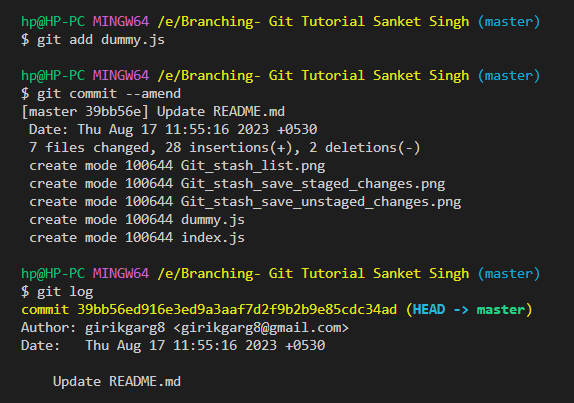
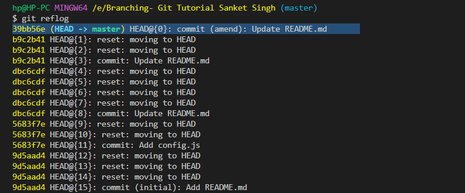
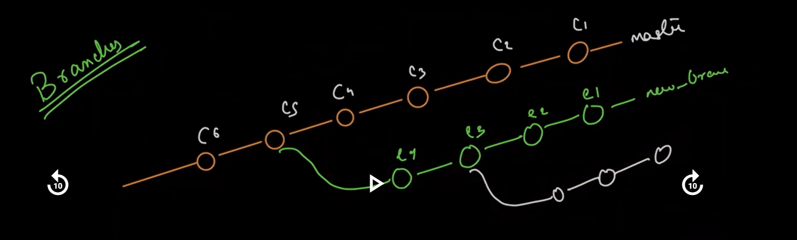
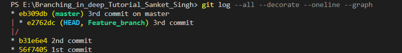
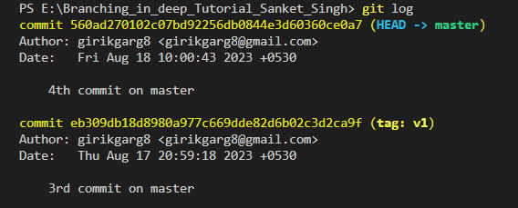
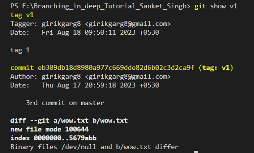
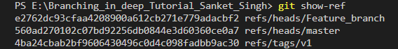
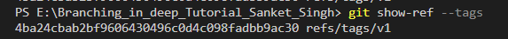

A basic understanding of git stash:

Can be said as a private locker where the changes can be stored temporarily, anything that is stashed is not a part of the commit.

Coming to more technical details:

Whenever we have some code changes that we don't want them to be a part of the next commit, we can add those changes to the staging area and then use `git stash`.

For our tutorial purpose, we want to stash config.js 

To view all the stash, we can use `git stash list`.

On using `git stash list`, we can see the different stashes, something like : 

The `git stash show stash@{n}` command is used in Git to display the changes that are stored in a stash. 

By using `git stash --include-untracked`, we can stash all the changes, including both that are in the working area (not staged) and those that are in the staging area.

How to include specific files only in the stash?

Approach #1 : Only stage specific file to staging area. Then use git stash

Approach #2 : Use `git stash --include-untracked -- <filename>`.

If we use `git stash pop`, the changes from the stash are restored, and also the stash is removed (just like popping from a stack).

Using `git stash drop stash@{n}` will pop the stash from the stack, but won't apply the changes.

If we want to pop all the stashes from the stack, we can use `git stash clear`.

By default, if we don't explicitly specify a stash message, then the stash message generated by Git will include the last commit message, But if we want to have more meaningful stash messages, we can use:

1. `git stash save <stash message>`: if the file changes are staged

2. `git stash save <stash message> --include-untracked` : if the file changes are not staged and are in the working area

What if we created a stash with some changes, after that that let's say we create a file dummy.js and want to add it to the previous stash, so there's a hack around it:

1. Use `git stash pop` to pop the previous stash from the stack
2. Stage the new file using `git add <filename>`
3. Now use `git stash` command to create the stash.

Let's discuss how we can include a missing file in a commit, without creating a new commit for it

1. Stage the file using `git add <missing file name>`

2. Use the `git commit --amend ` to include the staged files to the commit. We can also, optionally, update the commit message

3. If the previous commit was already pushed to remote, then we may need to force push the new commit (as the commit hash-id changes after staging a file)

The git log doesn't show the commit ammend, but if we use `git reflog`, we can actually see the ammend messages. So, technically speaking, nothing is lost in Git.

==> Branches in Git

Branches are a very misunderstood concept.

When we talk about branches in Git, we often visualize it as parallel timelines of the project. For visualizing and common understanding, it's good. 

But technically speaking, branches are nothing but a pointer to a commit.

Let's understand some important terms and their actual definitions before going further :

0. Ref: A ref referes to any pointer to a commit. Examples of refs include branches and tags. This term finds reference in 'reflog' etc

1. Branch: It is a pointer to a commit object. (Misconception: Branch is a parallel set of commits, running in parallel to the timeline. This is good for basic understanding and beginners, but isn't technically correct)

2. HEAD : HEAD is a pointer that points to the current branch, whereas a branch is a pointer to a commit object. So, essentially with the help of HEAD pointer, we can identify the current branch and the commit.

(Misconception related to HEAD: It is a pointer which points to the latest commit on the branch. This is not true in all cases).

3. Master: The default branch name i.e. by default master is the pointer to the commit objects.

4. Branch and HEAD are not fixed pointers, they keep moving according to the commits.

I created another repository E:/Branching_in_deep_Tutorial_Sanket_Singh to experiment...

The command `git log --graph` is used to display the commit history of a Git repository in a more visual and graph-like format.

For visual details on branching, refer this article, it has excellent visuals and explanation:  

[Understanding Branches in Git](https://itnext.io/understanding-refs-branches-and-dangling-commit-in-git-192251773c7c)

One important takeaway from the tutorial: 

Consider this git log message : 

` commit b31e6e4e0a443bab39a26a830f0c5de644ec3ed5 (HEAD -> Feature_branch, master)`

The log signifies that :

Feature_branch: This is the name of the branch that HEAD is currently pointing to. The -> arrow indicates that HEAD is pointing to this branch.

master: This part indicates that the master branch also points to the same commit. Both Feature_branch and master currently point to the same commit with the hash b31e6e4e0a443bab39a26a830f0c5de644ec3ed5.

Metaphorically speaking, `git checkout <branch name>` : What it does is that it tells git that for any futher commits, move the pointer corresponding to <branch name> (and henceforth the HEAD pointer too) to the commit.

The command `git log --all --decorate --oneline --graph` is used to display the commit history of all branches in a Git repository in a compact and visually informative format. 

Q. How to find which branch the HEAD is pointing to? 

A. Option1: Use `git log` command

Option2: By viewing the contents of the file `.git/HEAD`

Concept of tags in Git: Tags are also pointers to a commit, just like branches. However, they are different from branches in the fact that the branch pointer moves along with the latest commit , but the tag pointer always points a specific commit (which we want it to point to) using `git tag -a <tag name> -m <tag message>`

See the image below (the master branch pointer moves along with the latest commit, but the tag pointer still points to the commit where we made it point to):

Using `git show <tag name>`, we can see which commit the tag points to, and what changes were made in that particular commit. (Otherwise the git tag command can only be used with commit ID, but tag provides us a convenient way to refer to a commit).

To list all tags, we can use `git show-ref --tags`. If we also carefully analyse this command, it tells us to list all the refs. (Ref is nothing but a pointer to a commit), further it tells us to only show us the tags.

Output of git ref:

This proves that branches too are refs i.e. pointers to commits.

Output of `git show-ref --tags` :

The tags can be pushed to Github as well, by using `git push origin <tag name>` or we can also use `git push --tags origin master` which is used to push both commits and tags to a remote repository.