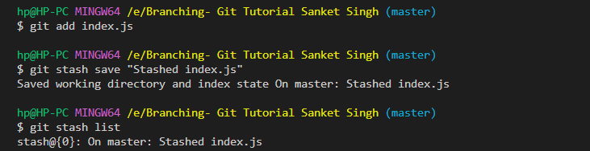

A basic understanding of git stash:

Can be said as a private locker where the changes can be stored temporarily, anything that is stashed is not a part of the commit.

Coming to more technical details:

Whenever we have some code changes that we don't want them to be a part of the next commit, we can add those changes to the staging area and then use `git stash`.

For our tutorial purpose, we want to stash config.js 

To view all the stash, we can use `git stash list`.

On using `git stash list`, we can see the different stashes, something like : 

The `git stash show stash@{n}` command is used in Git to display the changes that are stored in a stash. 

By using `git stash --include-untracked`, we can stash all the changes, including both that are in the working area (not staged) and those that are in the staging area.

How to include specific files only in the stash?

Approach #1 : Only stage specific file to staging area. Then use git stash

Approach #2 : Use `git stash --include-untracked -- <filename>`.

If we use `git stash pop`, the changes from the stash are restored, and also the stash is removed (just like popping from a stack).

Using `git stash drop stash@{n}` will pop the stash from the stack, but won't apply the changes.

If we want to pop all the stashes from the stack, we can use `git stash clear`.

By default, if we don't explicitly specify a stash message, then the stash message generated by Git will include the last commit message, But if we want to have more meaningful stash messages, we can use:

1. `git stash save <stash message>`: if the file changes are staged

2. `git stash save <stash message> --include-untracked` : if the file changes are not staged and are in the working area

